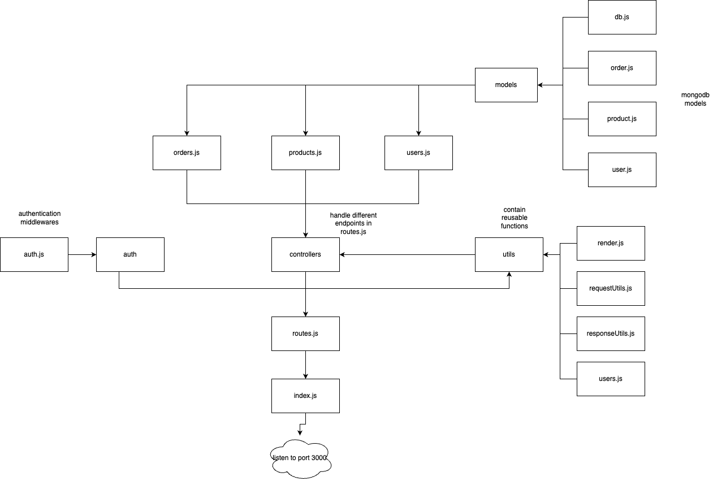
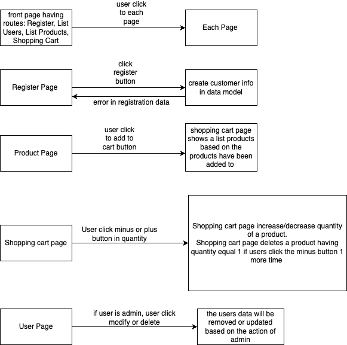

# Welcome to your group's Web Development 1 group work repository

# WebDev1 group work assignment, rounds 8-11

What should be in this document is detailed in the 11th exercise round assignment document in Google Docs. "Group" and "Tests and documentation" are shown below as examples and to give a starting point for your documentation work.

# Group 

Member1:  Minh Khanh Pham, minhkhanh.pham@tuni.fi, 151377446, 
resposible for: implement different routes of the project, implement the backend

Member2:  My Hoang, my.hoang@tuni.fi, 151395127, 
resposible for: implement different routes of the project, fix the user interface

Member 3: Yuhang Du, yuhang.du@tuni.fi, 151257294 
resposible for: implement different routes of the project (does not do round 11)

......

# Node Project Structure

# Pages and Navigation

## Data models

<b> User <b>

| Field | Type | Description |
| --- | --- | --- |
| _id | string | ID of user account |
| name | string | Name of user |
| email | string | Email of user account |
| password | string | Password of user account |
| role | string | Role of user (customer/admin) |

<b> Product <b>

| Field | Type | Description |
| --- | --- | --- |
| _id | string | ID of product |
| name | string | Name of product |
| price | float | Price of product |
| image | string | URL of product image |
| description | string | Description of product |

<b> Order <b>

| Field | Type | Description | Relationship |
| --- | --- | --- | --- |
| _id | string | ID of order | |
| customerId | string | ID of customer who placed the order | Reference to <b>User<b> model |
| items | Array< OrderedItem > | List of ordered items | Reference to the <b>Ordered Item<b> model |

<b> OrderedItem <b>

| Field | Type | Description | Relationship |
| --- | --- | --- | --- |
| _id | string | ID of product | |
| productId | Product | Ordered product | Reference to <b>Product<b> model |
| quantity | int | Number of items ordered | |

## Security concerns

<b>There are some security concerns our web can meet:</b>
* Cross-Site Scripting (XSS) injects malicious code into a web page, which then executes on the browser of the user who visits the page. The code can steal the user’s cookies, session tokens, or other sensitive information, or perform actions on behalf of the user. To prevent XSS, we should sanitize and encode the user input before displaying it on the web page, and use Content Security Policy (CSP) to restrict the sources of scripts that can be executed.
* Session hijacking exploits the vulnerability of the web application’s session management. The attacker can obtain the user’s session ID, either by intercepting the network traffic, or by using XSS or other methods, and then use it to impersonate the user and access their account. To prevent session hijacking, we should use HTTPS instead of HTTP, which encrypts the communication between the client and the server, and also use secure and HttpOnly flags for the cookies that store the session ID, which prevent them from being accessed by JavaScript or sent over insecure connections.
* Directory traversal attacks the vulnerability of the web application’s file system access. The attacker can manipulate the user input that specifies a file path, and use special characters such as “…” or “/” to access files or directories that are outside the intended scope, and can result in data theft, data corruption, or remote code execution. To prevent directory traversal, we should validate and sanitize the user input before using it as a file path, and also use a whitelist of allowed files or directories, or a blacklist of forbidden characters or patterns.
  

## Testing

| id   |      GitLab issues                                                                    |  Responsible Person | 
|------|:--------------------------------------------------------------------------------------|:----------------|
|  1   |  Implement `./controllers/products.js` https://course-gitlab.tuni.fi/webdev1-fall-2023-groupwork/webdev1-fall2023-group002/-/work_items/17 | Minh Khanh Pham |
|  2   |  Implement `./controllers/orders.js` https://course-gitlab.tuni.fi/webdev1-fall-2023-groupwork/webdev1-fall2023-group002/-/work_items/19| My Hoang |
|  3   |  Implement `./models/product.js` https://course-gitlab.tuni.fi/webdev1-fall-2023-groupwork/webdev1-fall2023-group002/-/work_items/16 | Minh Khanh Pham |
|  4   |  Implement `./models/order.js`https://course-gitlab.tuni.fi/webdev1-fall-2023-groupwork/webdev1-fall2023-group002/-/work_items/18 | My Hoang |
|  5   |  JSDoc Grader https://course-gitlab.tuni.fi/webdev1-fall-2023-groupwork/webdev1-fall2023-group002/-/issues/21 | Minh Khanh Pham |
|  6   |  ESlint Grader https://course-gitlab.tuni.fi/webdev1-fall-2023-groupwork/webdev1-fall2023-group002/-/work_items/26 | My Hoang |
|  7   |  ESlint with functional programming grader https://course-gitlab.tuni.fi/webdev1-fall-2023-groupwork/webdev1-fall2023-group002/-/work_items/27 | My Hoang |
|  8   |  Refactor `routes.js` handleRequests() Mocha grader https://course-gitlab.tuni.fi/webdev1-fall-2023-groupwork/webdev1-fall2023-group002/-/issues/20 | Minh Khanh Pham |
|  9   |  Update UI Mocha grader https://course-gitlab.tuni.fi/webdev1-fall-2023-groupwork/webdev1-fall2023-group002/-/issues/23 | My Hoang |
|  10   |  Write README part 1-3 https://course-gitlab.tuni.fi/webdev1-fall-2023-groupwork/webdev1-fall2023-group002/-/work_items/29 | My Hoang |
|  11   |  Write README part 4-7 https://course-gitlab.tuni.fi/webdev1-fall-2023-groupwork/webdev1-fall2023-group002/-/work_items/30 | Minh Khanh Pham |

## Finalization
<b>Summary</b>
* We built a web application for an online store using HTML, CSS, JavaScript, Node.js, and MongoDB.
* We learned the basics of browser, HTTP, and web development, such as rendering, templating, session management, and security.
* We applied various techniques and tools to create a dynamic, functional, and secure web application.

<b>How to run our code</b>
* To run our code, you will need to have Node.js, MongoDB, and npm installed on your computer. You can download and install them from their official websites .
* You will also need to install the dependencies for our web application, such as Express, EJS, jQuery, and others. You can do this by running the command npm install in the terminal, inside the folder where our code is located.
* To start the web application, you can run the command npm start in the terminal, inside the same folder. This will launch the web server and connect to the database.
* To access the web application, you can open your browser and go to the URL http://localhost:3000
* To test the web application, you can use the following credentials to log in as different roles: Admin: username: admin, password: admin; Customer: username: customer, password: customer

